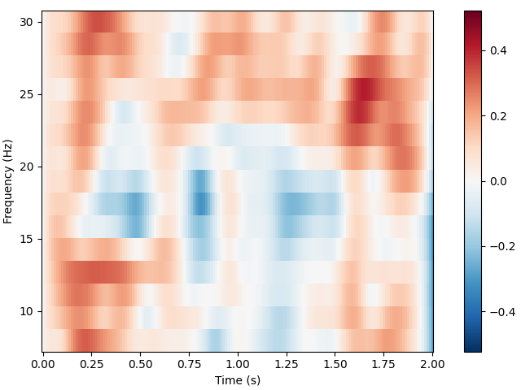
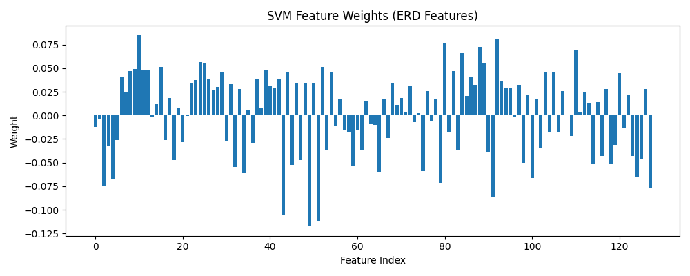

🧠 EEG Motor Imagery Classification using ERD Features

A beginner-friendly Neuro-AI project exploring how raw brain signals (EEG) can be transformed into meaningful features and used for machine learning classification.

Brain signals are messy.
Machine learning is picky.
This project is where they learned to get along 🤝

This project focuses on understanding the pipeline, not chasing state-of-the-art accuracy.

📊 Dataset

EEG Motor Movement/Imagery dataset from PhysioNet
(Schalk et al., 2004)

Subjects performed left/right motor imagery tasks while 64-channel EEG signals were recorded.

Reference: http://www.ncbi.nlm.nih.gov/pubmed/15188875

🔬 Pipeline Overview

Raw EEG → Filtering (1–40 Hz) → Event-based Epoching →
ERD Feature Extraction → SVM Classification → Model Interpretation

### When raw EEG first loads

🧠 Key Concepts Learned

EEG signal structure and frequency components

Brain rhythms (Mu: 8–12 Hz, Beta: 13–30 Hz)

Event-Related Desynchronization (ERD)

Feature engineering vs raw deep learning

Interpreting ML model weights using brain regions

📈 Visualizations
Raw EEG Signals

ERD Time-Frequency Representation

SVM Feature Weights (Interpretability)

🤖 Model

A linear Support Vector Machine (SVM) was trained using ERD-based features from motor cortex channels.

The model learns spatial rhythm differences between left vs right motor imagery.

🎯 Outcome

This project demonstrates how:

Signal processing

Neuroscience knowledge

Machine learning

combine in Brain–Computer Interface (BCI) systems.

It serves as a foundational stepping stone before moving to deep learning models.

When the model finally works

📓 Notebook

The complete pipeline notebook is available in this repository.

💡 Purpose of This Project

This is a learning project to understand Neuro-AI fundamentals:

How raw brain signals become AI-usable data.

📂 Project Structure
images/
  raw_eeg_plot.png
  erd_plot.png
  feature_weights.png
  pipeline_demo.gif

notebook/
  eeg_motor_imagery_pipeline.ipynb

  ### When the model finally works

